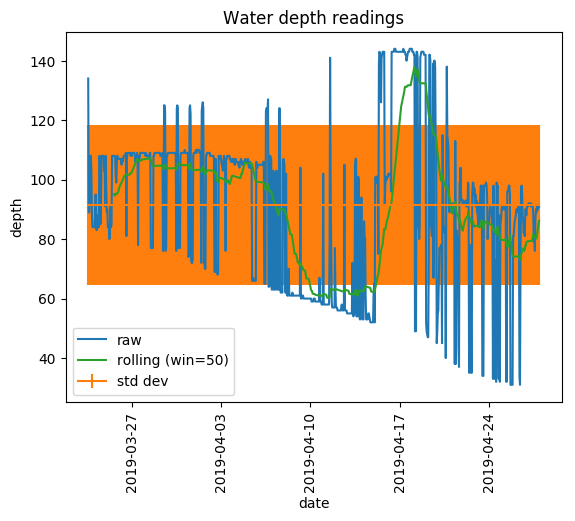
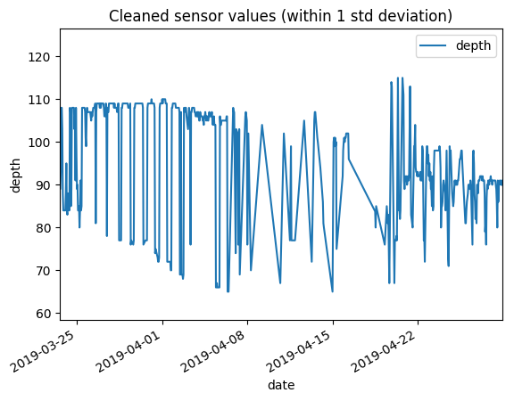
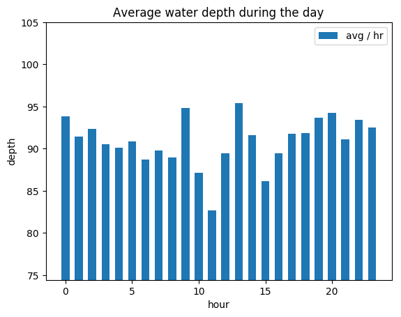

# Analysing data with Python

All of the sensor sampling and data upload is written in Python. But Python also has a very rich set of mathematical libraries and frameworks for analysing the data. This section describes the plot_data.py program that performs some mathematical analysis of the readings and generates some nice graphs.

## What does it do?
The program takes a CSV file containing data readings (download this from your ThingSpeak channel) then reads the data into a data structure. The code then uses the various python libraries to calculates means, standard deviations and group the data in different ways to get some kind of insights. All of the data is then turned into some nice-looking graphs.

Here are the graphs it produces. These are automatically refreshed on a regular basis and uploaded to github. So it is a kind of dashboard (not real-time, but at least every day):

### Raw data with some basic mean/std deviation
This is the raw data, but complemented with some other basic lines:
* mean water level
* smooth water readings calcualted using a rolling mean function
* standard deviation (+/- 1 std dev)



### Data cleaned by dropping readings > 1 std dev
This strips out data that exceeds 1 standard deviation from the mean. I was trying this as a way of cleaning up the data. The sensor is proving quite unreliable in the damp surroundings of a water tank. But as you can see, the data still fluctuates so much, as to make the readings almost unusable.



### Average tank level during the day
OK, this doesn't make sense over a long period, but it is useful to see how the level fluctuates over a shorter period - maybe during the summer. I may change this to only plot a sub-set of the data.



### Average tank level per day
This is a bit more useful - it averages the readings for a given day and plots this on a timeline, day-by-day for the entire data set. This shows how the water level fluctuates over the life-time of the project (up to the maximum 8000 data points allowed by ThingSpeak!)


### Weather data correlations
These graphs plot the different measurements (pressure, humidity, time, rainfall) against either to determine any obvious correlations.
This is done in the weather/plot_data.py code by iterating over all the combinations and generating a grid of subplots. This is too large to display here, so view it [here](../weather/fig_weather.png).

What do the graphs show (apart from the fact that weather patterns are complex and my analysis won't reveal very much)? Well, we can see that humidity and temperature seem inversely proportional - higher temperatures show lower humidity. Here is the specific graph:


## How does it do it?
I will write this up in more detail. In short:
* reading from the file is vanilla python or (for the weather graphs) directly via numpy (even easier)
* timezone handline is a bit of a pain
* vector handling and mathematical calculations (mean, standard deviation) are via numpy. Once you have numpy arrays, you can do a lot of data manipulation. And if you need to pass the data on to pandas, the numpy arrays play well with the other libraries.
* rolling mean calculations, 'group-by' operations and filtering of noisy data are via pandas (Series and Dataframes). This is great for functions that need to apply to a complete data set.
* graphs are generated using matplotlib (via pylot for non-pandas data, or the pandas API for more complex stuff). Matplotlib has endless possibilities for producing nice-looking graphs, so I've barely scratched the surface here.

## How do I run it?
First make sure the necessary python libraries are installed:
```
pip install numpy pandas matplotlib
```

Download the data file from your ThingSpeak.com channel (via their website). You could automate this if you like. Remember to choose the CSV format (we could have taken the JSON or XML formats, but CSV can be opened in Excel more easily).
Run the program, passing the data file as a parameter:
```
cd sensor
./plot_data.py feeds.csv
```

The program will read the data and output a bunch of graphs. These are saved as fig_XXX.png files in the current directory.
You can also optionally display the graphs as they are calculated:

```
./plot_data.py --show feeds.csv
```
